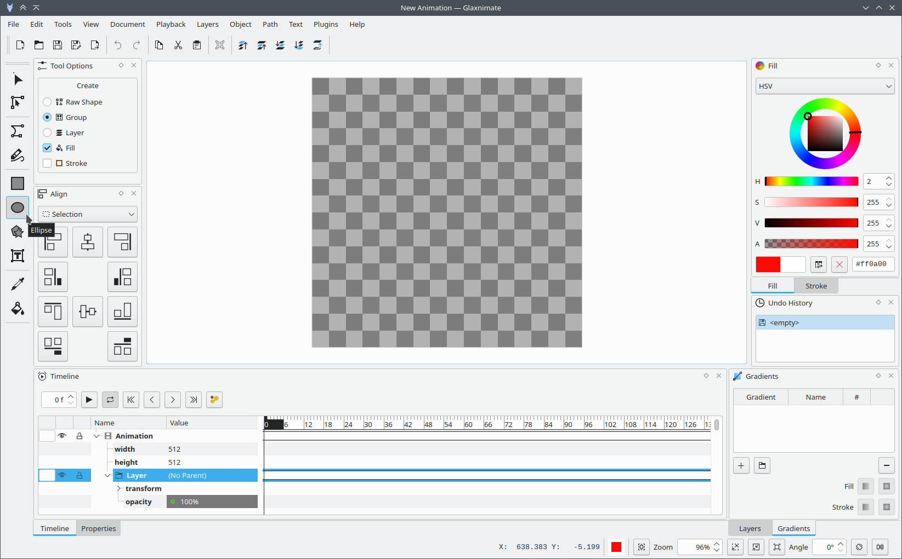
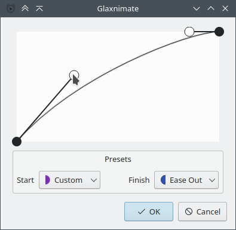
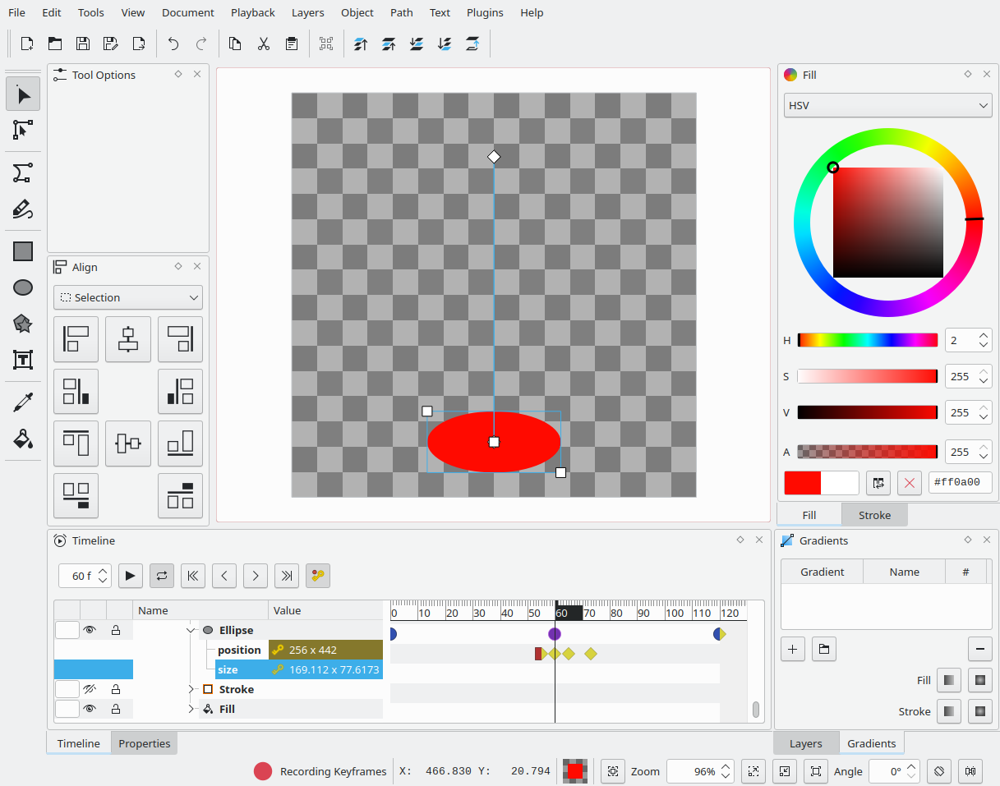

Authors: Mattia Basaglia

# Bouncing Ball

The bouncing ball animation is a common starting point for many animators,
as it serves as a simple yet effective demonstration of motion and timing.

This tutorial will guide you through the process of creating a
bouncing ball animation in Glaxnimate. So let's get started!

{lottie:bouncy-ball/ball-squish.json:512:512:ball-squish.rawr}

Create a new project
--------------------

When you start Glaxnimate a dialog with default templates shows up,
here select Telegam Sticker and ensure the framerate is 60 fps and the duration is 2 seconds.

If you don't see the dialog, you can create a new file,
then change the timing in _Document_ > _Timing_ as follows:

Creating the Ball
-----------------

Draw a circle shape to represent the ball.
You can do this by selecting the "Ellipse" tool from the toolbar,
then clicking and dragging the cursor to create a circle of the desired size.
If you hold Ctrl, Glaxnimate will ensure the ellipse is a perfect circle.

You can then switch to the edit tool and ensure the ellipse to is selected.

Basic Animation Loop
--------------------

On the timeline view below the canvas, you can expand the tree to view the properties of an ellipse.

To add the first keyframe, right click on the **position** row under the
ellipse shape and select "Add Keyframe" from the context menu.

Then move the timeline to frame 60 and drag the ellipse down
(or edit the position value on the timeline) and add another keyframe.

Finally, right click on the position row again and make it a looping animation.
This last step copies the value of the first keyframe at the end of the animation.

If you play the animation back, you'll see the ball moving up and down like so:

{lottie:bouncy-ball/ball-stiff.json:512:512:ball-stiff.rawr}

It works but the animation feels a bit stiff, because the ball is moving at a constant speed.

Easing
------

You could add more keyframes to represent the acceleration of the ball
but there's an easier way: changing the easing curve of the keyframe.

Right click on the first keyframe in the timeline and change
"Transition to Next" to "Ease".
Similarly, select the last keyframe and set the "Transition from Previous"
also to "Ease".

What this does is make the ball speed up as it leaves the first keyframe
and slow down to reach the last.

{lottie:bouncy-ball/ball-smooth.json:512:512:ball-smooth.rawr}

To make the effect more pronounced, we can use custom easing curves.

Follow the procedure as above, but select "Custom", then edit so the
keyframes easing curves look like these:

{lottie:bouncy-ball/ball-extra-smooth.json:512:512:ball-extra-smooth.rawr}

Squishing
---------

Currently the ball is not being deformed by the bounce, to make the animation even better,
we should change the size of the ellipse as it hits the bottom.

Setting all the keyframes manually is a bit tedious so we can enable the
keyframe recording mode, which automatically adds a keyframe whenever we make a change.

Now select a frame before the ball reaches the bottom of the canvas,
right click on the size and add a new keyframe,
then select the time at which the ball is at its lower point (it should be frame 60)
and change the size of the ball to make it wider and shorter,
then after a few frames, make the ball tall and skinny.

Finally, loop the animation as we did with the position and drag the last
keyframe towards the other.

In the end you should have something along these lines:

{lottie:bouncy-ball/ball-squish.json:512:512:ball-squish.rawr}
